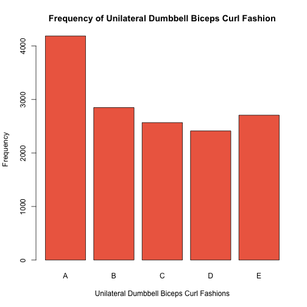

##  Introduction

## Data

+ Source: [source](http://groupware.les.inf.puc-rio.br/har)
+ Training data: [Train](https://d396qusza40orc.cloudfront.net/predmachlearn/pml-training.csv)
+ Test data: [Test](https://d396qusza40orc.cloudfront.net/predmachlearn/pml-testing.csv)

### Data acquisition and clean up

Download training and testing datasets.


```r
trainurl <- "https://d396qusza40orc.cloudfront.net/predmachlearn/pml-training.csv"
download.file(trainurl, method='curl', destfile='trainingfile')

testurl <- "https://d396qusza40orc.cloudfront.net/predmachlearn/pml-testing.csv"
download.file(testurl, method='curl', destfile='testfile')
```
No of observations and features in the training and test data


```r
train<-read.csv('trainingfile' ,na.strings=c("","NA", "#DIV/0!"))
dim(train)
```

```
## [1] 19622   160
```

```r
test<-read.csv('testfile' ,na.strings=c("","NA", "#DIV/0!"))
dim(test)
```

```
## [1]  20 160
```
Discard features with all missing values

There are 60 such columns 

```r
dim(train[,colSums(is.na(train))==0])
```

```
## [1] 19622    60
```

```r
which(colSums(is.na(train))==0)
```

```
##                    X            user_name raw_timestamp_part_1 
##                    1                    2                    3 
## raw_timestamp_part_2       cvtd_timestamp           new_window 
##                    4                    5                    6 
##           num_window            roll_belt           pitch_belt 
##                    7                    8                    9 
##             yaw_belt     total_accel_belt         gyros_belt_x 
##                   10                   11                   37 
##         gyros_belt_y         gyros_belt_z         accel_belt_x 
##                   38                   39                   40 
##         accel_belt_y         accel_belt_z        magnet_belt_x 
##                   41                   42                   43 
##        magnet_belt_y        magnet_belt_z             roll_arm 
##                   44                   45                   46 
##            pitch_arm              yaw_arm      total_accel_arm 
##                   47                   48                   49 
##          gyros_arm_x          gyros_arm_y          gyros_arm_z 
##                   60                   61                   62 
##          accel_arm_x          accel_arm_y          accel_arm_z 
##                   63                   64                   65 
##         magnet_arm_x         magnet_arm_y         magnet_arm_z 
##                   66                   67                   68 
##        roll_dumbbell       pitch_dumbbell         yaw_dumbbell 
##                   84                   85                   86 
## total_accel_dumbbell     gyros_dumbbell_x     gyros_dumbbell_y 
##                  102                  113                  114 
##     gyros_dumbbell_z     accel_dumbbell_x     accel_dumbbell_y 
##                  115                  116                  117 
##     accel_dumbbell_z    magnet_dumbbell_x    magnet_dumbbell_y 
##                  118                  119                  120 
##    magnet_dumbbell_z         roll_forearm        pitch_forearm 
##                  121                  122                  123 
##          yaw_forearm  total_accel_forearm      gyros_forearm_x 
##                  124                  140                  151 
##      gyros_forearm_y      gyros_forearm_z      accel_forearm_x 
##                  152                  153                  154 
##      accel_forearm_y      accel_forearm_z     magnet_forearm_x 
##                  155                  156                  157 
##     magnet_forearm_y     magnet_forearm_z               classe 
##                  158                  159                  160
```

```r
train<-train[,which(colSums(is.na(train))==0)]

dim(test[,colSums(is.na(test))==0])
```

```
## [1] 20 60
```

```r
which(colSums(is.na(test))==0)
```

```
##                    X            user_name raw_timestamp_part_1 
##                    1                    2                    3 
## raw_timestamp_part_2       cvtd_timestamp           new_window 
##                    4                    5                    6 
##           num_window            roll_belt           pitch_belt 
##                    7                    8                    9 
##             yaw_belt     total_accel_belt         gyros_belt_x 
##                   10                   11                   37 
##         gyros_belt_y         gyros_belt_z         accel_belt_x 
##                   38                   39                   40 
##         accel_belt_y         accel_belt_z        magnet_belt_x 
##                   41                   42                   43 
##        magnet_belt_y        magnet_belt_z             roll_arm 
##                   44                   45                   46 
##            pitch_arm              yaw_arm      total_accel_arm 
##                   47                   48                   49 
##          gyros_arm_x          gyros_arm_y          gyros_arm_z 
##                   60                   61                   62 
##          accel_arm_x          accel_arm_y          accel_arm_z 
##                   63                   64                   65 
##         magnet_arm_x         magnet_arm_y         magnet_arm_z 
##                   66                   67                   68 
##        roll_dumbbell       pitch_dumbbell         yaw_dumbbell 
##                   84                   85                   86 
## total_accel_dumbbell     gyros_dumbbell_x     gyros_dumbbell_y 
##                  102                  113                  114 
##     gyros_dumbbell_z     accel_dumbbell_x     accel_dumbbell_y 
##                  115                  116                  117 
##     accel_dumbbell_z    magnet_dumbbell_x    magnet_dumbbell_y 
##                  118                  119                  120 
##    magnet_dumbbell_z         roll_forearm        pitch_forearm 
##                  121                  122                  123 
##          yaw_forearm  total_accel_forearm      gyros_forearm_x 
##                  124                  140                  151 
##      gyros_forearm_y      gyros_forearm_z      accel_forearm_x 
##                  152                  153                  154 
##      accel_forearm_y      accel_forearm_z     magnet_forearm_x 
##                  155                  156                  157 
##     magnet_forearm_y     magnet_forearm_z           problem_id 
##                  158                  159                  160
```

```r
test<-test[,which(colSums(is.na(test))==0)]
```

Remove the following features/columns that are irrelevant and hence non-predictive


```r
colnames(train[,1:7])
```

```
## [1] "X"                    "user_name"            "raw_timestamp_part_1"
## [4] "raw_timestamp_part_2" "cvtd_timestamp"       "new_window"          
## [7] "num_window"
```

```r
train<-train[,-c(1:7)]
dim(train)
```

```
## [1] 19622    53
```

```r
test<-test[,-c(1:7)]
dim(test)
```

```
## [1] 20 53
```
## Preprocessing

### Further partitioning the training data into training and validation sets
Partition the data using random subsampling without replacement


```r
library(caret)
set.seed(1413)
trainset <- createDataPartition(y=train$classe, p=0.75, list=FALSE)
trainingSet <- train[trainset,]
validationSet <- train[-trainset,]
```


```r
dim(trainingSet)
```

```
## [1] 14718    53
```

```r
dim(validationSet)
```

```
## [1] 4904   53
```
Visualizing the distribution of the outcome variable


```r
plot(trainingSet$classe, col="coral2", main="Frequency of Unilateral Dumbbell Biceps Curl Fashion", xlab="Unilateral Dumbbell Biceps Curl Fashions", ylab="Frequency")
```

 
### Prediction using Random Forest
Train model on the training set and check the performance of the model by making predictions on the validation set.


```r
library(randomForest)
model <- randomForest(classe ~. , data=trainingSet, method="class")
model_prediction1 <- predict(model, trainingSet, type = "class")
```

Not surprising the model performs well on the dataset it was trained on and accurately predicts the outcome class


```r
confusionMatrix(model_prediction1, trainingSet$classe)
```

```
## Confusion Matrix and Statistics
## 
##           Reference
## Prediction    A    B    C    D    E
##          A 4185    0    0    0    0
##          B    0 2848    0    0    0
##          C    0    0 2567    0    0
##          D    0    0    0 2412    0
##          E    0    0    0    0 2706
## 
## Overall Statistics
##                                      
##                Accuracy : 1          
##                  95% CI : (0.9997, 1)
##     No Information Rate : 0.2843     
##     P-Value [Acc > NIR] : < 2.2e-16  
##                                      
##                   Kappa : 1          
##  Mcnemar's Test P-Value : NA         
## 
## Statistics by Class:
## 
##                      Class: A Class: B Class: C Class: D Class: E
## Sensitivity            1.0000   1.0000   1.0000   1.0000   1.0000
## Specificity            1.0000   1.0000   1.0000   1.0000   1.0000
## Pos Pred Value         1.0000   1.0000   1.0000   1.0000   1.0000
## Neg Pred Value         1.0000   1.0000   1.0000   1.0000   1.0000
## Prevalence             0.2843   0.1935   0.1744   0.1639   0.1839
## Detection Rate         0.2843   0.1935   0.1744   0.1639   0.1839
## Detection Prevalence   0.2843   0.1935   0.1744   0.1639   0.1839
## Balanced Accuracy      1.0000   1.0000   1.0000   1.0000   1.0000
```

## Model Evaluation

Evaluate model's performance on the held out dataset


```r
model_prediction2 <- predict(model, validationSet, type = "class")
confusionMatrix(model_prediction2, validationSet$classe)
```

```
## Confusion Matrix and Statistics
## 
##           Reference
## Prediction    A    B    C    D    E
##          A 1394    6    0    0    0
##          B    1  939    3    0    0
##          C    0    4  850    6    0
##          D    0    0    2  797    2
##          E    0    0    0    1  899
## 
## Overall Statistics
##                                           
##                Accuracy : 0.9949          
##                  95% CI : (0.9925, 0.9967)
##     No Information Rate : 0.2845          
##     P-Value [Acc > NIR] : < 2.2e-16       
##                                           
##                   Kappa : 0.9936          
##  Mcnemar's Test P-Value : NA              
## 
## Statistics by Class:
## 
##                      Class: A Class: B Class: C Class: D Class: E
## Sensitivity            0.9993   0.9895   0.9942   0.9913   0.9978
## Specificity            0.9983   0.9990   0.9975   0.9990   0.9998
## Pos Pred Value         0.9957   0.9958   0.9884   0.9950   0.9989
## Neg Pred Value         0.9997   0.9975   0.9988   0.9983   0.9995
## Prevalence             0.2845   0.1935   0.1743   0.1639   0.1837
## Detection Rate         0.2843   0.1915   0.1733   0.1625   0.1833
## Detection Prevalence   0.2855   0.1923   0.1754   0.1633   0.1835
## Balanced Accuracy      0.9988   0.9942   0.9958   0.9952   0.9988
```

Model performs well on the cross-validation dataset with 99.53% accuracy and out-of-sample error rate of 0.47%

## Prediction on the test dataset

Make class prediction on  unlabelled dataset


```r
model_prediction2 <- predict(model, test, type = "class")
model_prediction2
```

```
##  1  2  3  4  5  6  7  8  9 10 11 12 13 14 15 16 17 18 19 20 
##  B  A  B  A  A  E  D  B  A  A  B  C  B  A  E  E  A  B  B  B 
## Levels: A B C D E
```

## Submission

Prep files for submission. Write the class predicted for each observation in the test dataset into a file.


```r
write_class_predictions_to_file = function(x) {
     for (k in 1:length(x)) {
         file_name = paste0("problem_id_",k,".txt")
         write.table(x[k],file=file_name, quote=FALSE,row.names=FALSE,col.names=FALSE)
  }
}

write_class_predictions_to_file(model_prediction2)
```
